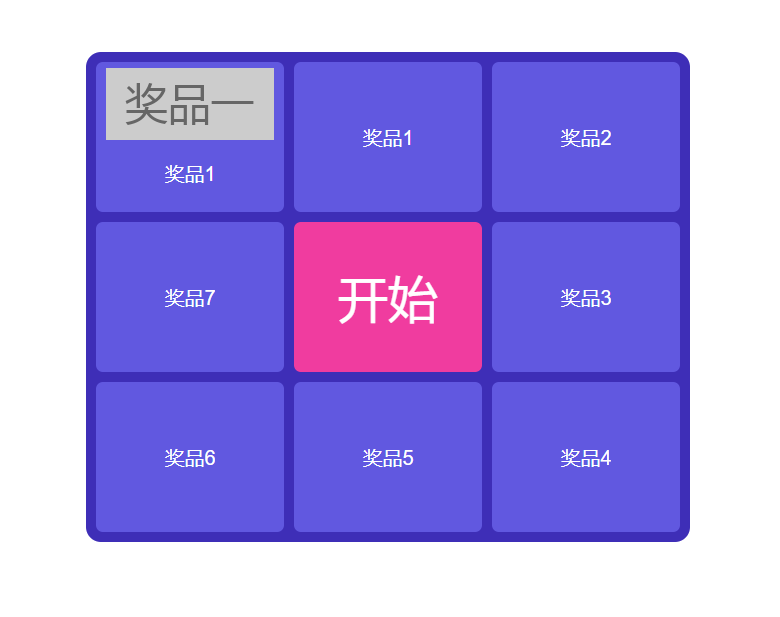

## 九宫格抽奖动画
该组件只是完成抽奖时的转动动画，具体业务逻辑还得看各自情况自行编写。
### 使用
在`demo.vue`文件中单文件注册
```html
<template>
  <div id="demo">
    <NineLottery :list="list" @start="startLottery" ref="lottery"></NineLottery>
  </div>
</template>
<script>
  import { NineLottery } from 'vue-simple-comp';
  export default {
    components: {
      [NineLottery.name]: NineLottery,
    },
    data() {
      return {
        // 奖品列表 会按照顺时针方向排列奖品列表
        list: [{ icon: 'http://iph.href.lu/168x72?text=%E5%A5%96%E5%93%81%E4%B8%80', name: '奖品1' }],
      };
    },
    methods: {
      startLottery() {
        // console.log('开始抽奖')
        setTimeout(() => {
          // 模拟ajax请求抽奖
          this.$refs.lottery.startCircle(4, () => {
            console.log('抽中了第四个');
          });
          // startCircle 开始抽奖动画方法 第一个参数为抽中了第几个，第二个参数为动画执行完后的回调函数
        }, 500);
      }
    }
  }
</script>
```
最终效果：


当然你也可以自己编写转盘内容，比如：
```html
<template>
  <div id="demo">
    <NineLottery @changeIndex="changeIndex" ref="lottery">
      <div class="prize" order="1" :class="{'on': prizeIndex == 1}">
        <p class="prize-name">奖品一</p>
      </div>
      <div class="prize" order="2" :class="{'on': prizeIndex == 2}">
        <p class="prize-name">奖品二</p>
      </div>
      <div class="prize" order="3" :class="{'on': prizeIndex == 3}">
        <p class="prize-name">奖品三</p>
      </div>
      <div class="prize" order="8" :class="{'on': prizeIndex == 8}">
        <p class="prize-name">奖品八</p>
      </div>
      <div class="lottery-btn" @click="startLottery">开始</div>
      <div class="prize" order="4" :class="{'on': prizeIndex == 4}">
        <p class="prize-name">奖品四</p>
      </div>
      <div class="prize" order="7" :class="{'on': prizeIndex == 7}">
        <p class="prize-name">奖品七</p>
      </div>
      <div class="prize" order="6" :class="{'on': prizeIndex == 6}">
        <p class="prize-name">奖品六</p>
      </div>
      <div class="prize" order="5" :class="{'on': prizeIndex == 5}">
        <p class="prize-name">奖品五</p>
      </div>
    </NineLottery>
  </div>
</template>
<script>
  import { NineLottery } from 'vue-simple-comp';
  export default {
    components: {
      [NineLottery.name]: NineLottery,
    },
    data() {
      return {
        prizeIndex: 0, // 当前滚动到的奖品索引 从1开始到8
      };
    },
    methods: {
      startLottery() {
        // console.log('开始抽奖')
        setTimeout(() => {
          // 模拟ajax请求抽奖
          this.$refs.lottery.startCircle(4, () => {
            console.log('抽中了第四个');
          });
          // startCircle 开始抽奖动画方法 第一个参数为抽中了第几个，第二个参数为动画执行完后的回调函数
        }, 500);
      },
      // 用来供给组件调用的方法，用于改变滚动到当前奖品的索引
      changeIndex(i) {
        this.prizeIndex = i;
      }
    }
  }
</script>
```
正如上面的例子所写，如果采用自己编写奖品列表，请确保填充了八个奖品列表以及一个抽奖按钮。并且这个时候可以不用传递list参数及开始抽奖的方法，但是需绑定changeIndex这个方法，用于传递给你当前转到到第几个奖品位置。
组件提供了几个class用于默认样式：
* `prize` 奖品模块样式
* `prize-name` 奖品模块中的奖品名称样式
* `prize-icon` 奖品模块中奖品图标的样式
* `on` 当前选中的奖品模块样式
* `lottery-btn` 抽奖按钮样式
如果想要修改样式，可以正对上述class做样式重写，也可以自己编写奖品模板的时候编写自己的样式

### 参数说明
参数 | 类型 | 默认值 | 说明
-|-|-|-
list | Array[Object] |  | 奖品列表,如果是自己渲染奖品模板那么不用传递list
list[].icon | String |  | 奖品列表数组中每个对象的图标属性,用于表示奖品的图标
list[].name | String |  | 奖品列表数组中每个对象的名称属性,用于表示奖品的名称
btnTxt | String | 开始 | 抽奖按钮的文案显示
cycle | Number | 50 | 控制动画基本需要转动的次数
speed | Number | 100 | 控制动画的初始转动速度
start | Function |  | 在使用组件渲染奖品模板的情况下，点击抽奖所需要执行的方法使用@绑定
changeIndex | Function |  | 在不适用组件渲染奖品模板的情况下，动画转动时通过此方法告知当前转到到第几个

### 特殊说明
给组件绑定ref属性后。通过`vm.$refs.ref名.startCircle`这个方法来开始抽奖动画，`startCircle`接受两个参数，第一个为转动到第几个停止，第二个为动画执行完毕后的回调函数